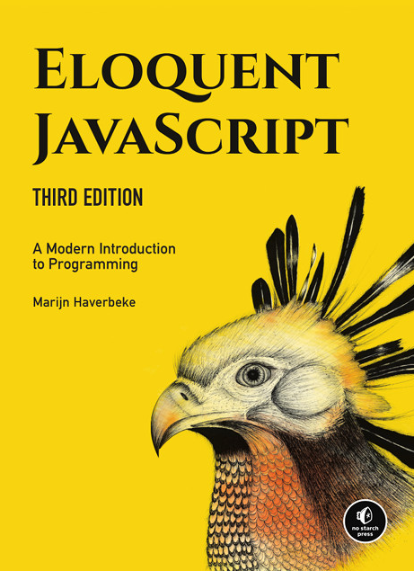
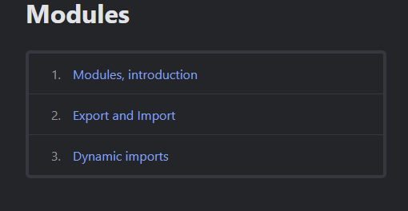
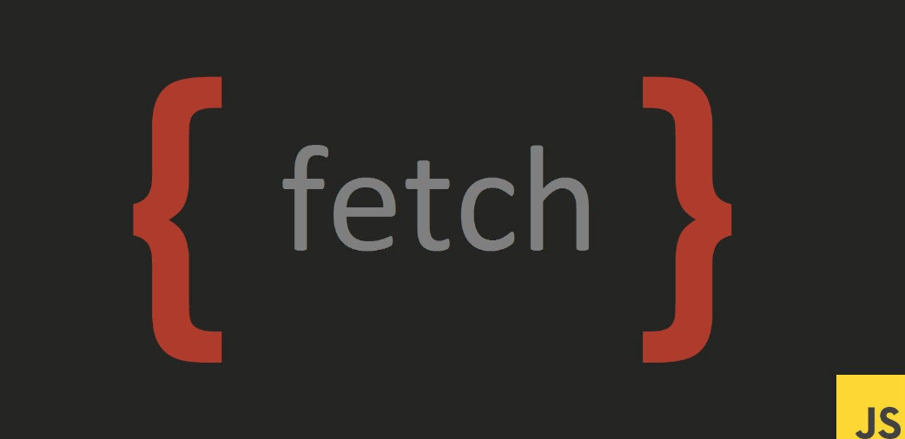
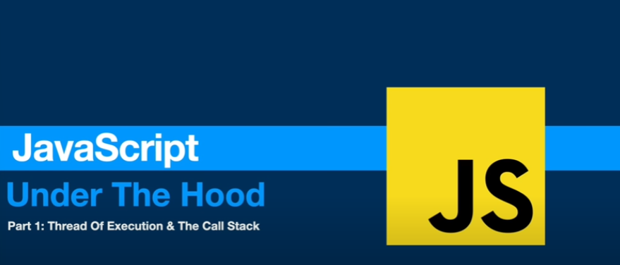
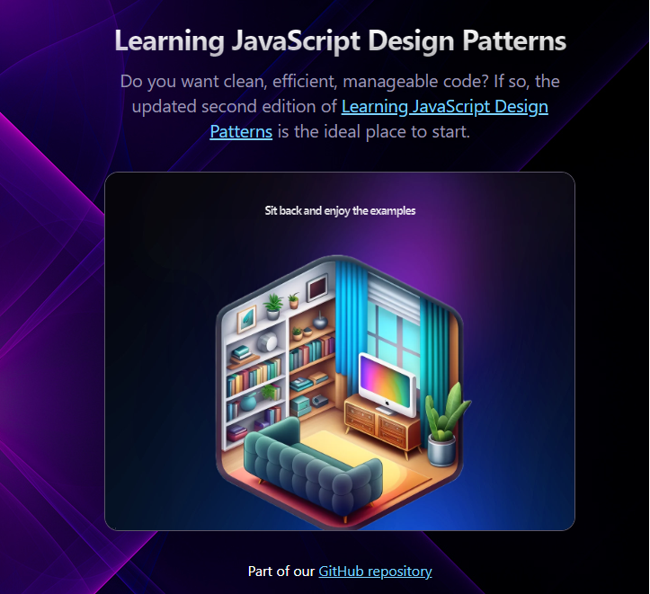
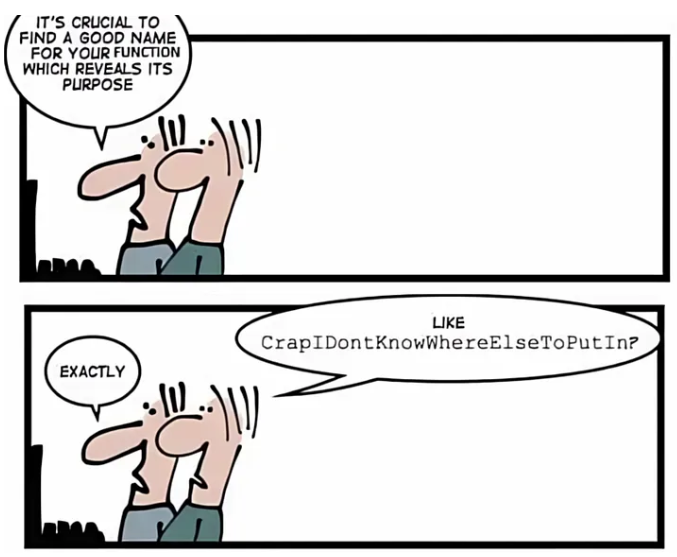

# JavaScript Intermediate Syllabus

 - This is a dedicated learning Roadmap For a Fullstack Web developement from intermediate front end to full stack dedicated for intermediate Programmer feel free to contribute.

 Table of content:later 
 

## Introduction to Classes

🎓 **Roadmap Overview**: Dive into the world of classes, constructor functions, and instances. Understand the basics of object-oriented programming in JavaScript.

⏱️ **Learning Time**: 2 weeks

🚀 **Projects and Exercises**:
- Create a class representing a Library.
- Build a School Catalogue using class inheritance.

💡 **Inspiration Quote**: "Classes are the building blocks of a great code structure."

📖 **Learning Resources**:
1. MDN Web Docs - Classes
2. JavaScript.info - Classes
3. Eloquent JavaScript - Classes

**MDN Web Docs - Classes**:

- [MDN Web Docs](https://developer.mozilla.org/en-US/docs/Web/JavaScript/Reference/Classes) is a comprehensive and authoritative resource provided by Mozilla.The Classes section on MDN covers the syntax and usage of classes in JavaScript.It often includes examples, explanations, and links to related concepts.

**JavaScript.info - Classes**:

- [JavaScript.info](https://javascript.info/class) is a thorough tutorial site with a focus on JavaScript.
The Classes section on JavaScript.info provides in-depth coverage of classes, including concepts like inheritance, static methods, and more.
It's known for its clear explanations and interactive examples.

**Eloquent JavaScript - Classes**:

- [Eloquent JavaScript](https://eloquentjavascript.net/1st_edition/chapter8.html) is a widely acclaimed book by Marijn Haverbeke that teaches JavaScript concepts.
The Classes chapter in Eloquent JavaScript covers the basics of object-oriented programming in JavaScript.
It often includes practical exercises to reinforce learning.
These resources complement each other well. You might consider going through the MDN Web Docs for a solid foundation, then exploring JavaScript.info for a deeper understanding, and finally, using Eloquent JavaScript for practical exercises to reinforce your knowledge.

[Third edition](https://eloquentjavascript.net/)

## Modules

🎓 **Roadmap Overview**: Learn about JavaScript runtime environments and explore the power of modular programming. Implement modules in both Node.js and ES6 syntax.

⏱️ **Learning Time**: 3 weeks

🚀 **Projects and Exercises**:
- Develop a Message Mixer using Node.js.
- Create a WorkAround Explorer using ES6 modules.

💡 **Inspiration Quote**: "Modules are the secret sauce of scalable and maintainable code."

## Promises

🎓 **Roadmap Overview**: Understand asynchronous programming with JavaScript Promises. Explore how to handle asynchronous operations more efficiently.

⏱️ **Learning Time**: 2 weeks

🚀 **Projects and Exercises**:
- Implement a feature using JavaScript Promises.

💡 **Inspiration Quote**: "Promises pave the way for a smoother, more reliable code journey."

📖 **Learning Resources**:

1. **MDN Web Docs - Modules:**
   - [MDN Web Docs - Modules](https://developer.mozilla.org/en-US/docs/Web/JavaScript/Guide/Modules)
   - MDN Web Docs provides comprehensive and reliable documentation for web technologies. Their guide on JavaScript modules covers the basics, syntax, and usage of modules.

2. **Node.js Documentation - Modules:**
   - [Node.js Documentation - Modules](https://nodejs.org/api/modules.html)
   - If you're working with Node.js, the official Node.js documentation is an essential resource. This page specifically covers the `module` system in Node.js, including how to use `require` to include modules.

3. **JavaScript.info - Modules:**
   - [JavaScript.info - Modules](https://javascript.info/modules)
   - JavaScript.info is an excellent resource for learning JavaScript. Their modules section provides in-depth coverage of modules, including the ES6 `import` and `export` syntax.

   [Modules](https://javascript.info/modules)

 Basic concepts to practical usage. Depending on your preference and learning style, exploring these different sources can provide a well-rounded understanding of JavaScript modules.

## Async-Await

🎓 **Roadmap Overview**: Delve deeper into asynchronous programming with the Async-Await syntax. Enhance your code readability and maintainability.

⏱️ **Learning Time**: 2 weeks

🚀 **Projects and Exercises**:
- Refactor existing code using Async-Await.

📖 **Learning Resources**:

-understanding asynchronous functions and the `async`/`await` syntax in JavaScript:

1. **MDN Web Docs - Async functions:**
   - [MDN Web Docs - Async functions](https://developer.mozilla.org/en-US/docs/Web/JavaScript/Reference/Statements/async_function)
   - MDN Web Docs is a reliable source for JavaScript documentation. The Async functions section covers the basics of asynchronous functions, how to define them, and how to work with promises.

   [Async](https://developer.mozilla.org/en-US/docs/Web/JavaScript/Reference/Statements/async_function)

2. **JavaScript.info - Async-Await:**
   - [JavaScript.info - Async/Await](https://javascript.info/async-await)
   - JavaScript.info is known for its clear explanations and examples. The Async/Await section provides a comprehensive guide to using `async` and `await` for handling asynchronous code in JavaScript.

3. **W3Schools - Async/Await:**
   - [W3Schools - JavaScript Async/Await](https://www.w3schools.com/js/js_async.asp)
   - W3Schools offers beginner-friendly tutorials. The JavaScript Async/Await tutorial covers the basics of asynchronous programming using `async` and `await`, with examples and exercises.

These resources cover a range of topics related to asynchronous programming in JavaScript, with a focus on `async` functions and the `await` keyword. Depending on your learning style and preferences, exploring these different sources can provide a well-rounded understanding of asynchronous JavaScript.

💡 **Inspiration Quote**: "Async-Await: Where coding meets poetry."

## Requests

🎓 **Roadmap Overview**: Master handling HTTP requests in JavaScript. Use the Fetch API to communicate with servers and fetch data.

⏱️ **Learning Time**: 2 weeks

🚀 **Projects and Exercises**:
- Create a Film Finder application using Fetch API.

📖 **Learning Resources**:

- Here are some learning resources for understanding and working with the Fetch API in JavaScript:

1. **MDN Web Docs - Fetch API:**
   - [MDN Web Docs - Fetch API](https://developer.mozilla.org/en-US/docs/Web/API/Fetch_API)
   - MDN Web Docs provides comprehensive documentation on the Fetch API, covering its features, usage, and examples. This is a reliable and authoritative resource for web development.

2. **JavaScript.info - Fetch:**
   - [JavaScript.info - Fetch](https://javascript.info/fetch)
   - JavaScript.info offers clear and detailed tutorials on JavaScript. The Fetch section covers the basics of making HTTP requests with the Fetch API, including how to send requests and handle responses.

3. **FreeCodeCamp - How to use the Fetch API:**
   - [FreeCodeCamp - How to use the Fetch API](https://www.freecodecamp.org/news/javascript-fetch-api-tutorial-with-js-fetch-post-and-header-examples/)
   - FreeCodeCamp provides practical guides and tutorials. This article specifically covers how to use the Fetch API with detailed code examples, making it suitable for hands-on learning.

   [Fetch API](https://www.freecodecamp.org/news/javascript-fetch-api-tutorial-with-js-fetch-post-and-header-examples/)

These resources will give you a solid understanding of the Fetch API and how to use it to make HTTP requests in JavaScript. Depending on your preference, you can explore these different sources to gain a comprehensive understanding of the topic.

💡 **Inspiration Quote**: "Requests unlock the door to a world of possibilities in web development."

## Errors and Error Handling

🎓 **Roadmap Overview**: Embrace errors as part of the coding journey. Develop a new perspective on debugging and error handling in JavaScript.

⏱️ **Learning Time**: 2 weeks

🚀 **Projects and Exercises**:
- Implement error handling in your previous projects.

📖 **Learning Resources**:

- JavaScript errors and error handling:

1. **MDN Web Docs - Error:**
   - [MDN Web Docs - Error](https://developer.mozilla.org/en-US/docs/Web/JavaScript/Reference/Global_Objects/Error)
   - MDN Web Docs provides comprehensive documentation on the `Error` object in JavaScript. This resource covers the properties and methods of the `Error` object and how to work with errors in JavaScript.

2. **JavaScript.info - Error handling:**
   - [JavaScript.info - Error handling](https://javascript.info/error-handling)
   - JavaScript.info offers in-depth tutorials on JavaScript topics. The Error handling section covers various aspects of handling errors in JavaScript, including `try...catch`, custom errors, and error objects.

3. **Stack Overflow - Common JavaScript Errors:**
   - [Stack Overflow - Common JavaScript Errors](https://developer.mozilla.org/en-US/docs/Web/JavaScript/Reference/Global_Objects/Error)
   
   - While Stack Overflow is a Q&A platform, it's an excellent resource for finding solutions to common problems. This page compiles information on common JavaScript errors and how to resolve them.

    [Error handling](https://blog.alexdevero.com/error-handling-javascript/)

These resources provide a comprehensive understanding of JavaScript errors, how to handle them, and common issues that developers may encounter. Exploring these sources will help you become proficient in identifying and addressing errors in your JavaScript code.

💡 **Inspiration Quote**: "Errors are stepping stones to mastery."

## JavaScript Under the Hood

🎓 **Roadmap Overview**: Explore advanced JavaScript concepts like currying, hoisting, concurrency model, and the event loop. Understand memory management and debugging memory issues.

⏱️ **Learning Time**: 4 weeks

🚀 **Projects and Exercises**:
- Apply memory management techniques in a real-world scenario.

**Learning Resources**:
- Advanced topics
- Mozilla Hacks - JavaScript Internals
- YouTube - What the heck is the event loop anyway?

[Underthehood](https://www.youtube.com/watch?v=-G9c4CMMUKc)

[underthehood](https://www.youtube.com/watch?v=boD0ReK62FI)

💡 **Inspiration Quote**: "To master JavaScript, one must understand it under the hood."

## JavaScript Best Practices

🎓 **Roadmap Overview**: Learn industry-standard design patterns in JavaScript. Apply best practices for writing clean, efficient, and maintainable code.

⏱️ **Learning Time**: 3 weeks

🚀 **Projects and Exercises**:
- Implement a chosen design pattern in a project.
Certainly! Here are some learning resources for JavaScript design patterns and writing clean, maintainable code:

1. **Addy Osmani - JavaScript Design Patterns:**
   - [Addy Osmani - JavaScript Design Patterns](https://addyosmani.com/learning-jsdp/)
   - Addy Osmani, a well-known developer advocate at Google, has written a book on Essential JavaScript Design Patterns. This resource provides insights into various design patterns and their practical usage in JavaScript.

   [website](https://addyosmani.com/learning-jsdp/)

2. **Kinsta.com- Design Patterns:**
   - [Kinsta.com - Design Patterns](https://kinsta.com/blog/javascript-design-patterns/)
   - JavaScript.info covers design patterns in JavaScript, offering explanations and examples of various patterns such as Singleton, Factory, Observer, and more. This is a comprehensive guide for understanding and applying design patterns in your JavaScript code.

   [website](https://kinsta.com/blog/javascript-design-patterns/)

3. **Google- Clean Codes :**
   - [Googgle; - Clean Code JavaScript](https://blog.bitsrc.io/5-ways-to-write-clean-javascript-code-19aa6338fe00)
[website](https://blog.bitsrc.io/5-ways-to-write-clean-javascript-code-19aa6338fe00)

These resources cover design patterns and best practices for writing clean JavaScript code. Exploring these materials will enhance your understanding of software design principles and help you write more efficient and maintainable code in JavaScript.

💡 **Inspiration Quote**: "Design patterns are the architectural blueprints of successful code."

## Next Steps

🎓 **Roadmap Overview**: Prepare for advanced topics and lay the foundation for diving into React.js in the future,after you have learned the intermediate part dive into frame works but I suggest to familiarize yourself with Git/GitHub along the way .

⏱️ **Learning Time**: Ongoing

🚀 **Capstone Project**:
- Create a comprehensive project applying all learned concepts. This would be MERN stack as the Frame work.

## 🚀 The Capstone Project overview: Example TaskMaster

### Project Overview:

TaskMaster is a task management web application designed to help users organize their daily tasks efficiently. The goal is to provide a user-friendly interface for creating, updating, and managing tasks. Users can categorize tasks, set due dates, and mark tasks as completed.

### Technologies Used:

- **Front-end:** React.js, Redux for state management, Bootstrap for styling.
- **Back-end:** Node.js, Express.js.
- **Database:** MongoDB.
- **Authentication:** JSON Web Tokens (JWT).

### Features:

1. User authentication and authorization.
2. Create, update, and delete tasks.
3. Categorize tasks into different lists.
4. Set due dates for tasks.
5. Mark tasks as completed.
6. Search and filter tasks.

### Project Structure:

- **Front-end:**
  - Components folder for React components.
  - Redux for state management.
  - Routing using React Router.

- **Back-end:**
  - Express.js server with API routes.
  - MongoDB database for storing tasks.
  - JWT for authentication.

### Development Timeline:

1. **Week 1-2:** Set up project structure, implement user authentication.
2. **Week 3-4:** Develop task management features.
3. **Week 5:** Implement styling and responsiveness.
4. **Week 6:** Testing and debugging.
5. **Week 7:** Finalize documentation and prepare for deployment.

### Learning Goals:

- Gain hands-on experience with React.js and Redux.
- Master user authentication and authorization in a Node.js environment.
- Practice building a full-stack application from scratch.

### Project Screenshots:

*Include screenshots or wireframes of the application's UI.*

### Challenges Anticipated:

- Integrating Redux for state management.
- Implementing real-time updates for tasks.
- Ensuring data security and authentication best practices.

### Future Enhancements:

- Integration with third-party calendars.
- Collaborative task management features.
- Mobile app version.

### Conclusion:

TaskMaster aims to be a practical and feature-rich task management application, providing a comprehensive learning experience in full-stack development with a focus on React.js and Node.js.

### Resources:

- [React Documentation](https://reactjs.org/docs/getting-started.html)
- [Node.js Documentation](https://nodejs.org/en/docs/)
- [Redux Documentation](https://redux.js.org/introduction/getting-started)

💡 **Inspiration Quote**: "Every end is a new beginning. React awaits your mastery."

---

## Congratulations! 🎉

You've completed the Intermediate JavaScript journey. Now, the path to React.js excellence lies ahead. Happy coding!

To be Updated along the way 
 
